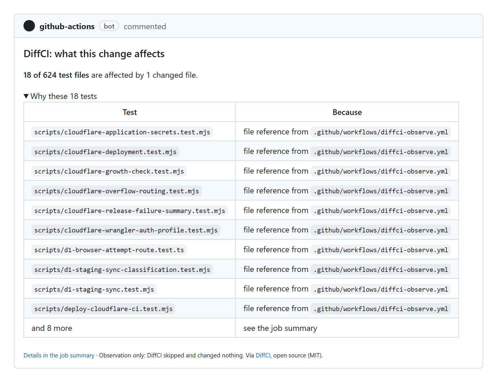
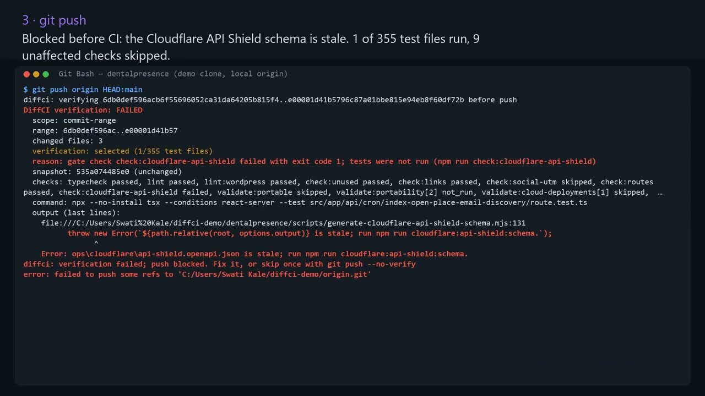
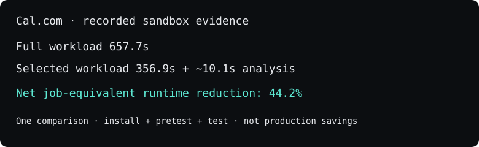

# DiffCI Core

[](https://www.npmjs.com/package/@diffci.com/diffci)
[](https://github.com/marketplace/actions/diffci-change-impact)
[](LICENSE)
[](https://scorecard.dev/viewer/?uri=github.com/DiffCI/core)

**Affected checks before push, for AI coding agents.** DiffCI tells Claude Code, Codex, Cursor (or you) which tests and checks a change affects, so they run before the push instead of failing at the full CI gate afterwards. MIT licensed, runs locally, sends nothing by default, and falls back to the full suite whenever the evidence is incomplete.

```sh
npx "@diffci.com/diffci@latest" check
```

Run it in any Git checkout with Node.js 22.5+. [What the output means](docs/using-diffci.md).

If DiffCI saves you CI time, a ⭐ helps others find it.

**On every pull request**, add one job beside your existing CI. Its job summary shows which tests the change affects and why, or that the full suite is needed and why. It runs no tests and skips or changes nothing:

```yaml
- uses: actions/checkout@v7
- uses: DiffCI/core@v0.3.38
```

Add `with: comment: "true"` (and `pull-requests: write` on the job) and the same answer appears on the pull request itself, updated in place on each push:



[Full workflow](examples/github-actions-observer.yml) · [GitLab CI/CD component](integrations/gitlab/README.md)

[](https://www.youtube.com/watch?v=ychCnVVRQq0)

▶ [Watch the demo on YouTube](https://www.youtube.com/watch?v=ychCnVVRQq0)

## Why

Coding agents pass the narrow check they picked and miss wider breakage, then rerun the whole suite when they are unsure. We measured this on our own agent-built production app (about 1,100 commits in two months, most of them co-authored by Claude):

- **104 pushes failed the full gates after push.** Each passed whatever the agent ran locally.
- **Agents chose their own test files 928 times and ran the full suite 282 times**, but asked a tool which tests were affected only 24 times.
- **When DiffCI could narrow the run, it selected 2.2% of test files**, cutting test time by 93%. None of those commits had a failing test, so this shows speed, not regression catching.
- **DiffCI still fell back to the full suite on 58% of commits**, mostly because a config file or `package.json` changed. Narrowing those safely is the main open problem, and [a good place to contribute](#contributing).

## MCP server

This repository contains DiffCI's MCP server. It is implemented in
[`packages/diffci-cli/src/client/mcp.ts`](packages/diffci-cli/src/client/mcp.ts)
and published as the `diffci-mcp` binary of `@diffci.com/diffci`: a local
stdio server speaking JSON-RPC 2.0 (`initialize`, `tools/list`, `tools/call`)
that runs against the checkout it is pointed at. It needs no account and sends
nothing by default.

```sh
npx -y -p @diffci.com/diffci@latest diffci-mcp
```

```json
{
  "mcpServers": {
    "diffci": { "command": "npx", "args": ["-y", "-p", "@diffci.com/diffci@latest", "diffci-mcp"] }
  }
}
```

| Tool | What it does |
| --- | --- |
| `diffci_changed_files` | Lists staged, unstaged and untracked changes; runs no tests |
| `diffci_select_tests` | Returns the affected-test plan for the current changes, with fallback reasons; runs no tests |
| `diffci_explain_selection` | The same plan, for explaining why each test is in it |
| `diffci_run_affected_tests` | Verifies the current snapshot with the affected tests, or the full suite as a fallback |
| `diffci_verify_changed` | Verifies the exact working-tree snapshot; fails closed |
| `diffci_verify` | Verifies a clean commit range and returns a receipt bound to HEAD |
| `diffci_check` | Compares full and selected test runs and reports paired runtime |
| `diffci_init` | Seeds agent instructions, MCP configs, the verify skill and a pre-push hook |
| `diffci_verify_workflow` | Checks that a DiffCI GitHub Actions job cannot affect the rest of CI |

## Use it from your coding agent

The public [`integrations/agent-plugin`](integrations/agent-plugin) package
packages the MCP server above as a checkout-aware local plugin for agent
marketplaces: marketplace metadata, skills, and a launcher pinned to the
published `diffci-mcp` binary. It does not include product services or private
source. The
[cross-agent installation guide](docs/agent-installation.md) covers Codex,
Claude Code, Cursor, Grok, Meta Muse Code, and generic MCP hosts.

```sh
# Codex
codex plugin marketplace add DiffCI/core
codex plugin add diffci@diffci-local

# Claude Code
claude plugin marketplace add DiffCI/core
claude plugin install diffci@diffci-marketplace
```

Cursor Marketplace reads [`.cursor-plugin/marketplace.json`](.cursor-plugin/marketplace.json)
from this repository. Meta Muse Code reads the native root
[`marketplace.json`](marketplace.json). Before a public listing is approved,
use the local MCP configuration in the agent-plugin package or visit
https://diffci.com/mcp-server.

Installing the plugin does not make an agent use it. Paste the
[short agent-instructions snippet](docs/agent-installation.md#short-snippet)
into `CLAUDE.md` or `AGENTS.md` so it runs DiffCI before pushing.

## GitHub Action

The public [`action.yml`](action.yml) ("DiffCI change impact") shows, in the
job summary of every pull request, which tests the change affects and why, or
that the full suite is needed and why. It is observation only: it runs the
pinned published DiffCI CLI outside the observed checkout, retains existing CI
jobs, skips nothing, and uploads the report as an artifact. See the
[observer Action guide](docs/github-action-observer.md) and
[workflow example](examples/github-actions-observer.yml).

Set `comment: "true"` (with `pull-requests: write`) to also keep one comment on
the pull request up to date with the answer, where reviewers see it. Outputs
such as `full-suite-required` and `affected-tests` let a workflow act on the
answer; see [outputs](docs/github-action-observer.md#outputs).

Set `verify: "true"` for a [fast check](docs/github-action-observer.md#fast-check):
the Action also runs the affected tests and lint/typecheck, likeliest failures
first, and fails within minutes when one breaks. It adds a job and skips
nothing, so your full test job stays as it is
([example](examples/github-actions-fast-check.yml)).

The [v0.3.10 corresponding source](https://github.com/DiffCI/core/tree/4c76be14cec37d94eb7df93922f3c29d202f4e65/packages/diffci-cli)
remains publicly available at tagged Core commit `4c76be14` (`cli-v0.3.10-source`)
while distribution migrates to the Core-native CLI package.

`diffci check` compares full and selected runtime when safe to measure, writes reports outside the checkout, and sends nothing by default. Test commands can generate files; keep required CI authoritative.

**Measured example:** one controlled Cal.com sandbox replay measured **44.2% net reduction** in install + pretest + test runtime including analysis overhead. This is a job-equivalent comparison, not production savings or a forecast for your repository. [Method and limitations](https://diffci.com/case-studies/calcom).



[Star Core](https://github.com/DiffCI/core) · [Volunteer a pilot repository](https://diffci.com/#pilot) · [Find a first contribution](https://github.com/DiffCI/core/issues?q=is%3Aopen+label%3A%22good+first+issue%22).
Watch → Custom → Releases and Discussions for benchmark results and support updates. [Public roadmap](docs/roadmap.md).

This is the standalone Core engine. It analyzes local JavaScript/TypeScript repositories, supported Vue components, root Go modules, conventional Maven reactors and Python projects tested with pytest, traces dependency impact, infers GitHub Actions structure and proposes test selections with evidence and full-run fallbacks. It works without a DiffCI account, hosted service or API key. See [the release boundary](docs/release-boundary.md) for support limits.

**Want to try DiffCI in an existing repository?** Use the published CLI: `npx @diffci.com/diffci@latest check`. See [the CLI quickstart](docs/using-diffci.md) for a no-execution analysis option, prerequisites, and result interpretation. To get help setting it up and have the cases that matter to your repository fixed first, [join as a design partner](https://github.com/DiffCI/core/issues/86). Tried it already? [Share your result](https://github.com/DiffCI/core/issues/new?template=community-result.yml), including fallbacks, refusals and misses, and choose whether we may publish it. The commands below build the standalone engine from source.

## Run locally

Requires Git and Node.js 22.5 or later.

```sh
git clone https://github.com/DiffCI/core.git
cd core
npm ci
npm run build
npm test
node dist/cli.js plan --repo /path/to/clean-checkout --base HEAD~1 --head HEAD
```

The target must be a clean Git repository root checked out at `--head`. Fetch the base commit beforehand if using a shallow clone. JSON goes to stdout; analysis errors exit nonzero and recommend full CI. Core does not execute repository scripts, contact a DiffCI backend or send telemetry. Installation requires the npm registry.

To evaluate the same command on pull requests without changing required jobs, copy the [advisory GitHub Actions example](examples/README.md).

**Plans are advisory.** This release does not execute, skip or cancel CI jobs. `SKIP_CANDIDATE` is a candidate, not permission to bypass a check. Keep full CI authoritative while evaluating Core. Missing command synthesis, unsupported configuration and incomplete evidence must not be treated as an empty test suite. Static analysis is not proof that a test can safely be omitted.

For Maven jobs whose CI runs a lifecycle goal or profiles other than `test`, declare them in `diffci.json` (or the `diffci` key in `package.json`):

```json
{ "maven": { "goal": "verify", "profiles": ["run-its"] } }
```

This changes the proposed command, such as `mvn -pl tools -am verify -P run-its`; Core still does not run it. Confirm the command against the repository's CI workflow before using it for execution.

## What is included

Declared pnpm workspaces with a single Vitest test phase can receive package-local command plans. Each selected path must belong to a discovered test in a declared package. Runtime selections are batched to keep commands below Windows limits; packages declaring `--typecheck` retain a separate full type-test phase. Packages with compound scripts, lifecycle hooks, overlapping ownership or discovery blind spots refuse selective execution. Commands remain advisory and must be executed separately; CLI automatic timing of multiple commands requires additional integration.

| Area | Implementation |
| --- | --- |
| Changes and dependencies | Git deltas, repository inventory, JS/TS dependency graph, impact traversal |
| Safety and planning | Risk signals, conservative fallback, always-run policy, test selection and command synthesis |
| CI analysis | GitHub Actions evidence, job/reference graphs, conditions and matrix inference |
| Reproducible evaluation | Synthetic benchmark and portable regression tests |
| Measurement | Current-process wall time, CPU time and ending RSS; explicit-input cost/energy/carbon estimates |

The library entry point exports `analyzeCheckout`, `buildDependencyGraph`, `ImpactAnalyzer`, `DefaultCIPlanner`, `collectEvidence`, `inferPipeline`, `measure` and `estimateImpact`. Lower-level modules are available as package subpaths. This repository is the engine source, and the published [`@diffci.com/diffci` CLI](https://www.npmjs.com/package/@diffci.com/diffci) is released from it. The corresponding source for the previously published v0.3.10 package is retained in the [source archive at tagged commit `4c76be14`](https://github.com/DiffCI/core/tree/4c76be14cec37d94eb7df93922f3c29d202f4e65/packages/diffci-cli).

```sh
npm run typecheck
npm run audit:boundary
npm run benchmark
```

The benchmark constructs one temporary synthetic repository containing 100 chained modules and 100 importing test files. In one Node.js process it builds that same dependency graph three times, sequentially, and removes the fixture afterward. Install dependencies first with `npm ci`, then run `npm run benchmark` under Node.js 22.5 or later. Record the emitted `node` and `platform` alongside the machine CPU, memory, operating system, and competing workload when comparing runs. The three builds share process, operating-system, and compiler warmup effects; they are not independent repetitions with controlled cold caches.

Each entry in `runs` has these fields:

| Field | Interpretation |
| --- | --- |
| `basis: "measured"` | The process counters were observed rather than estimated. |
| `scope: "current-process"` | Only the benchmark's Node.js process is covered, not the whole host, container, or CI job. |
| `wallSeconds` | Elapsed wall-clock time around one `buildDependencyGraph` call. |
| `cpuSeconds` | User plus system CPU time consumed by the current process during that call; it can differ from wall time. |
| `rssBytesAtEnd` | Resident-set size sampled after the call. It is neither peak memory nor the memory allocated by that call alone. |
| `nodes`, `edges` | Graph size. The current fixture should produce 200 nodes and 199 dependency edges. |
| `confidence` | Dependency-graph confidence for this synthetic fixture. `COMPLETE` does not prove that a real repository can safely skip tests. |

For example, `wallSeconds: 0.79`, `cpuSeconds: 0.84`, and `rssBytesAtEnd: 327868416` mean that one graph build elapsed for about 0.79 seconds, consumed about 0.84 current-process CPU seconds, and ended with roughly 328 MB RSS. They do **not** mean that CI became 0.79 seconds faster or saved 328 MB. The script does not execute tests, installation, builds, or a full-versus-selected comparison, so its timings must not be reported as CI savings.

The separate `estimateImpact` API can calculate `estimatedUsd`, `estimatedKwh`, and `estimatedKgCo2e` only from caller-supplied `computeSeconds`, price, power, and grid-intensity assumptions. Those values have `basis: "estimated"`; they are modeled scenarios, not benchmark output, physical measurements, billing records, or verified avoided emissions.

## Sponsors

DiffCI Core is supported by its [GitHub Sponsors](https://github.com/sponsors/DiffCI). Sponsorship funds maintenance, broader language and CI support, and reproducible benchmarks.

### Partners

No Partner sponsors yet. [Become the first](https://github.com/sponsors/DiffCI).

### Team Sponsors

No Team Sponsors yet. Team Sponsor logos also appear on [diffci.com/sponsors](https://diffci.com/sponsors).

### Backers

No Backers yet. Backers at $25/month or above are listed here.

Sponsors' bug reports are labelled [`sponsor`](https://github.com/DiffCI/core/labels/sponsor) and triaged first.

## Core and Cloud

| Component | Availability | License |
| --- | --- | --- |
| This Core repository | Public source | MIT |
| DiffCI Cloud: hosting, billing, organization management, dashboard, managed services | Private source | Proprietary; not included here |
| Optional enterprise modules | Not released here | A separate source-available license would apply if offered |

Only the explicitly extracted Core files and standalone tooling are in this repository. There is no private monorepo history, customer data, deployment configuration or Cloud implementation here. Core is usable independently; it is not a promise that the private product has already migrated to consume this package.

DiffCI Cloud's team features are free for public open-source repositories: an organization whose connected repositories are all public on GitHub gets them at no cost.

What stays in Core, and never moves to Cloud, is set out in [STEWARDSHIP.md](STEWARDSHIP.md). The plan DiffCI writes for each change is an open format other tools can produce or consume: [the change plan](docs/change-plan.md). Report vulnerabilities privately as described in [SECURITY.md](SECURITY.md).

## Contributing

Most open work is teaching DiffCI to narrow changes it currently treats as "run everything": config files, `package.json` edits and lockfiles. Each case is small and comes with a synthetic fixture, so you don't need to learn the whole engine. Django, Rust and PHP support are next and split into one-PR steps: see the [Django](https://github.com/DiffCI/core/issues/87), [Rust](https://github.com/DiffCI/core/issues/62) and [PHP](https://github.com/DiffCI/core/issues/88) tracking issues, or the [Go](https://github.com/DiffCI/core/issues/76) and [Maven](https://github.com/DiffCI/core/issues/89) ones for fewer full-suite fallbacks. Pick a [good first issue](https://github.com/DiffCI/core/issues?q=is%3Aopen+label%3A%22good+first+issue%22) and see [CONTRIBUTING.md](CONTRIBUTING.md); a dev container is included.

### Contributors

Thank you to everyone who has improved DiffCI:

- <a href="https://github.com/KingEmma7"></a> **[Emmanuel Mawulolo Tagbor](https://github.com/KingEmma7)**: [`diffci check-plan`](docs/using-diffci.md#compare-a-plan-with-a-full-suite-junit-report) for comparing a saved plan with full-suite JUnit results ([#74](https://github.com/DiffCI/core/pull/74)), Yarn Classic lockfile narrowing ([#63](https://github.com/DiffCI/core/pull/63)), and follow-ups ([#67](https://github.com/DiffCI/core/pull/67), [#70](https://github.com/DiffCI/core/pull/70)).
- <a href="https://github.com/FredApps"></a> **[@FredApps](https://github.com/FredApps)**: five safety fixes for runtime module dependencies, Maven module resources, runner suites, deleted assets and Go runtime inputs ([#32](https://github.com/DiffCI/core/pull/32)–[#36](https://github.com/DiffCI/core/pull/36)).
- <a href="https://github.com/shounakjoshi88-a11y"></a> **[Shounak Joshi](https://github.com/shounakjoshi88-a11y)**: Go package-owned `testdata` selection, so a golden-file edit runs the owning package's tests instead of the full suite ([#85](https://github.com/DiffCI/core/pull/85)).
- <a href="https://github.com/bfs2021"></a> **[@bfs2021](https://github.com/bfs2021)**: `bun.lock` and `npm-shrinkwrap.json` recognition in the lockfile signal ([#64](https://github.com/DiffCI/core/pull/64)).
- <a href="https://github.com/sarankumar1325"></a> **[@sarankumar1325](https://github.com/sarankumar1325)**: `bun.lock` detection in CI inference ([#105](https://github.com/DiffCI/core/pull/105)), removal of dead config-file patterns with a test for every entry ([#106](https://github.com/DiffCI/core/pull/106)), and a shared lockfile list so every lockfile invalidates the Vue analysis cache ([#107](https://github.com/DiffCI/core/pull/107)).
- <a href="https://github.com/robertwmccarty-caelum"></a> **[@robertwmccarty-caelum](https://github.com/robertwmccarty-caelum)**: the Vitest reporter/timeout config fixture and its narrowing conditions ([#53](https://github.com/DiffCI/core/issues/53#issuecomment-6514436312), landed in [#65](https://github.com/DiffCI/core/pull/65)).
- <a href="https://github.com/varshith84"></a> **[Varshith Sai Pasupuleti](https://github.com/varshith84)**: tests for transitive Vue selection and full fallback ([#16](https://github.com/DiffCI/core/pull/16)).

Every merged contribution is credited in the release notes, here, and next to the feature in the docs.

## License

See [LICENSE](LICENSE), [NOTICE](NOTICE) and [CONTRIBUTING.md](CONTRIBUTING.md). Releases before the MIT switch were published under AGPL-3.0-only and are now also available under MIT; see [LICENSE-HISTORY.md](LICENSE-HISTORY.md). Grant eligibility depends on the particular grant agreement. No eligibility or legal separation is guaranteed by this repository layout.

See [the release boundary](docs/release-boundary.md) for scope and current limitations.

Useful? [Star the engine](https://github.com/DiffCI/core) and [share a reproducible pilot result](https://diffci.com/#pilot).
